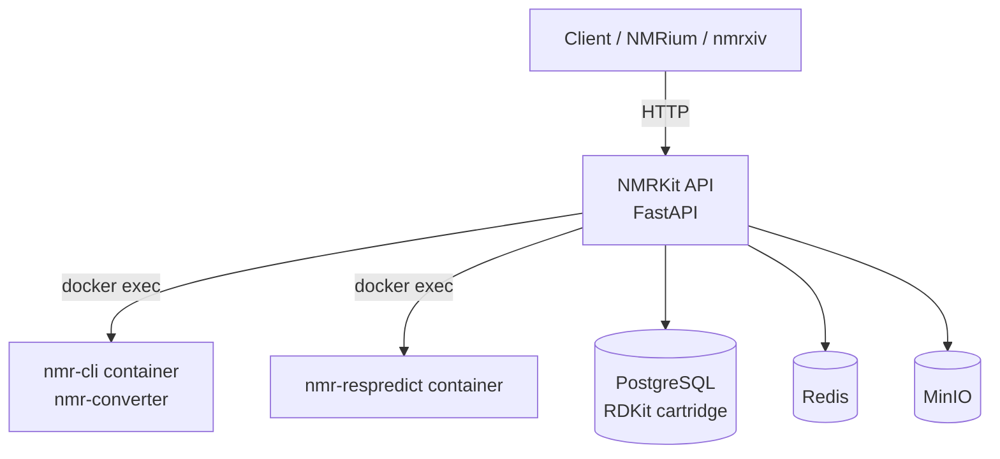

# Architecture

NMRKit is a FastAPI application that exposes a versioned REST API for NMR data
processing, conversion, prediction, and molecule registration. Heavy lifting for
spectra parsing and prediction is delegated to companion Docker containers that
run the **nmr-cli** and **nmr-respredict** toolchains.

## System overview



## Components

| Component | Container name | Purpose |
|-----------|----------------|---------|
| **NMRKit API** | `nmrkit-api` | FastAPI gateway, versioning, health checks, Prometheus metrics |
| **nmr-cli** | `nmr-converter` | Parse spectra, convert formats, predict shifts via nmrdb.org / nmrshift |
| **nmr-respredict** | `nmr-respredict` | Residual-based NMR prediction (planned integration) |
| **PostgreSQL** | `pgsql` | Molecule registration (lwreg) and RDKit cartridge queries |
| **Redis** | `redis` | Caching and background task support |
| **MinIO** | `minio` | Object storage for uploaded files |
| **Prometheus** | `nmrkit_prometheus` | Metrics collection |
| **Grafana** | `nmrkit_grafana` | Metrics dashboards |

## API modules

All endpoints are mounted under a version prefix (for example `/latest/` or `/v1/`).

| Module | Prefix | Description |
|--------|--------|-------------|
| **Chemistry** | `/chem` | HOSE code generation (CDK / RDKit) |
| **Spectra** | `/spectra` | Parse NMR data from files, URLs, publication strings, or peak lists |
| **Converter** | `/convert` | Convert raw NMR data to NMRium JSON |
| **Predict** | `/predict` | Predict NMR spectra from molecular structures |
| **Registration** | `/registration` | Register, query, and retrieve molecules via lwreg |

See the [interactive API reference](https://dev.nmrkit.nmrxiv.org/latest/docs) (Scalar)
or the module pages in this documentation for endpoint details.

## How nmr-cli is invoked

The API container mounts the Docker socket and executes commands inside the
`nmr-converter` container:

```bash
docker exec nmr-converter nmr-cli parse-spectra -u <url>
docker exec nmr-converter nmr-cli predict -s "<mol block>" --engine nmrshift ...
```

A shared volume (`/shared`) is used to pass files between containers when
uploading MOL files for prediction.

## API versioning

NMRKit uses [fastapi-versioning](https://github.com/one-thd/fastapi-versioning):

- `/latest/` — always points to the newest API version
- `/v1/` — stable version 1 endpoints
- `/latest/openapi.json` — OpenAPI schema used by Scalar

## Interactive documentation

API documentation is served by [Scalar](https://scalar.com/) at `/latest/docs`
and `/v1/docs`. The root URL (`/`) redirects to the docs by default.

Public instances:

- **Development:** https://dev.nmrkit.nmrxiv.org/latest/docs
- **Production:** https://nmrkit.nmrxiv.org/latest/docs
